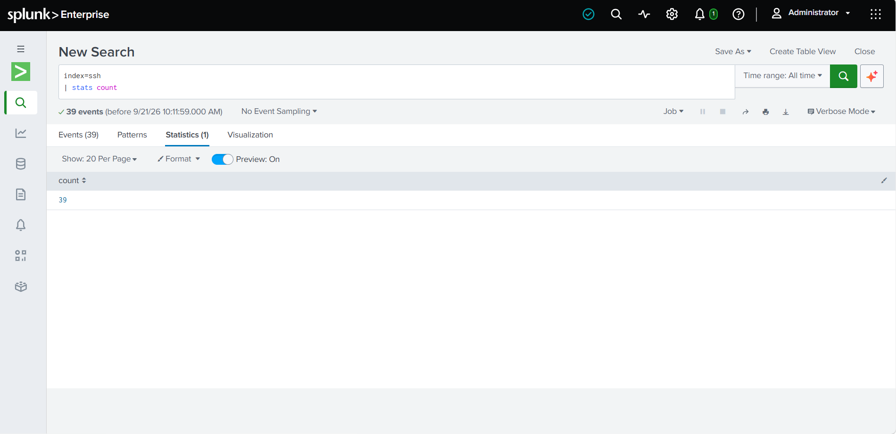
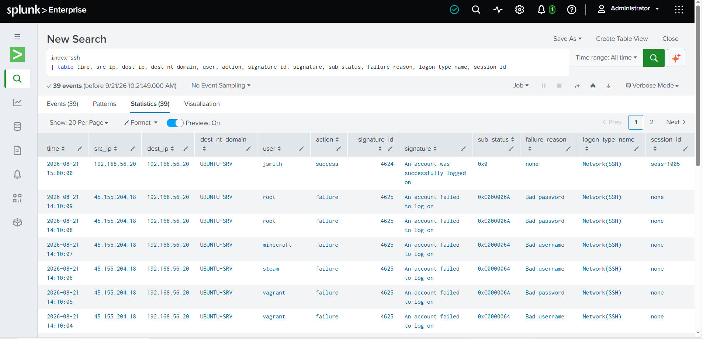
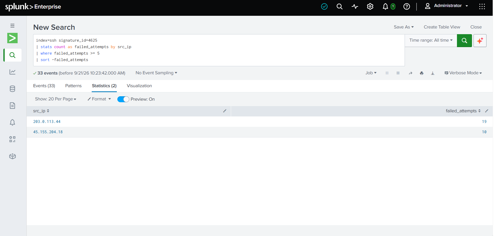
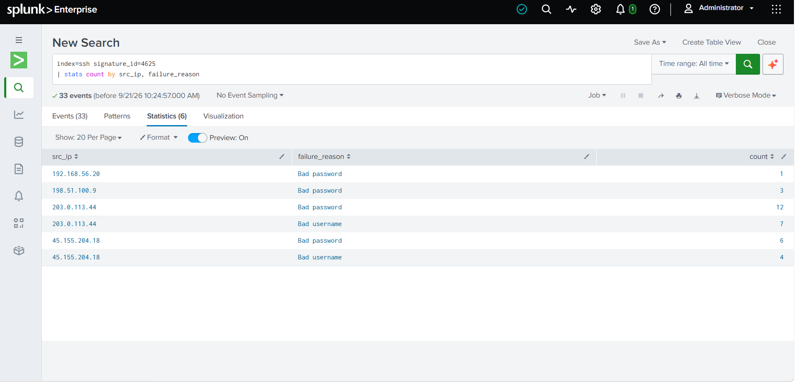
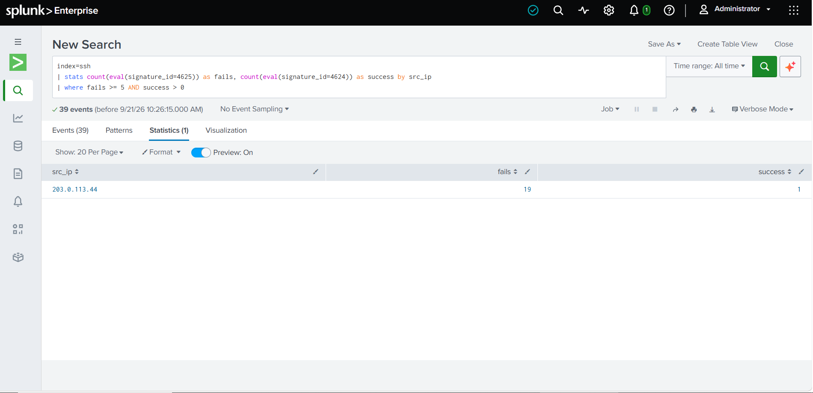
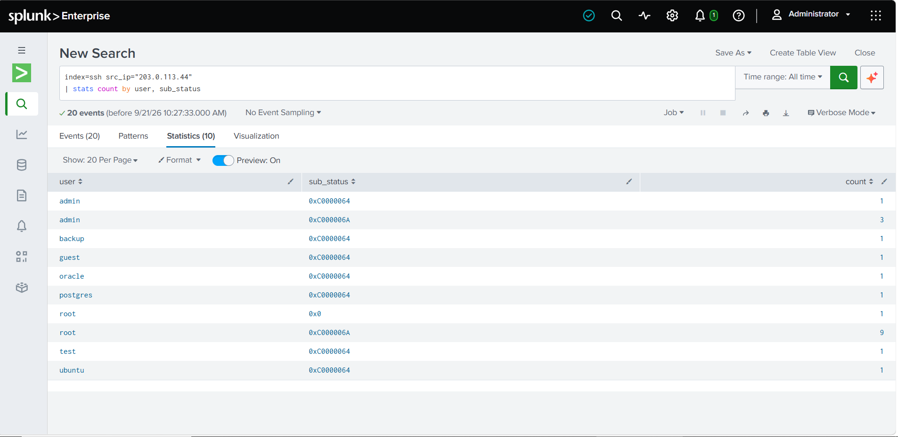
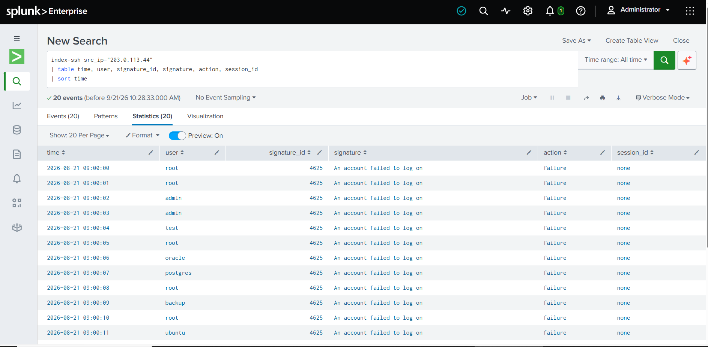
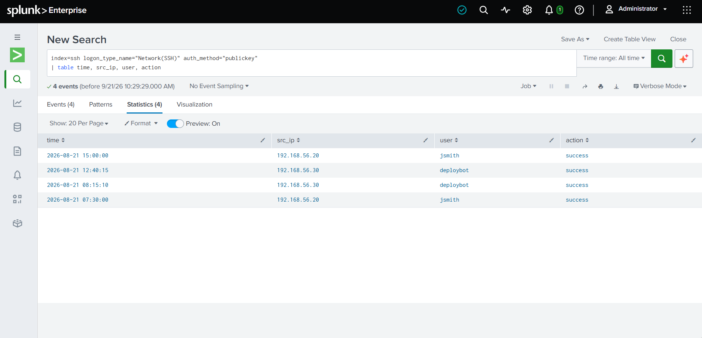
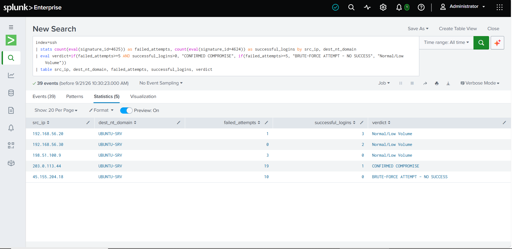

# 🛡️ SSH Brute-Force Detection & Investigation

**SOC L1 Investigation | Splunk | Linux Authentication Logs**

---

## 01. Investigation Overview

### Objective

Detect and investigate suspicious SSH authentication activity by identifying:

- Repeated failed authentication attempts
- Repeated attempts from the same source IP
- Targeted user accounts (real vs. non-existent)
- Successful authentication following failed attempts
- Legitimate key-based access vs. password brute-force attempts

### Tools Used

- **SIEM:** Splunk Enterprise 10.4.2
- **Log Source:** Linux SSH Authentication Logs (CSV, CIM-aligned fields)
- **Query Language:** SPL
- **Investigation Level:** SOC L1

---

## 02. Investigation Summary

| Attribute | Finding |
|---|---|
| **Source IP** | `203.0.113.44` |
| **Target Host** | `192.168.56.20 (UBUNTU-SRV)` |
| **Failed Attempts** | **20** |
| **Successful Authentication** | **Observed** |
| **Successful Event** | `4624` |
| **Logon Type** | `10 — Network(SSH)` |
| **Compromised Account** | `root` |
| **Assessment** | **Confirmed Account Compromise** |

> **⚠️ Priority:** High  
> Repeated failed authentication attempts were followed by successful authentication as `root` from the same source IP.

Two additional source IPs were investigated and found to be unsuccessful brute-force attempts:

| Source IP | Failed Attempts | Target | Result |
|---|---|---|---|
| `198.51.100.9` | 3 | administrator | No success |
| `45.155.204.18` | 10 | Multiple IoT-default usernames (pi, vagrant, steam, minecraft) | No success |

---

## 03. Log Fields Used

| Field | Description | Investigation Purpose |
|:---:|---|---|
| `signature_id` | Event code (4625=failed, 4624=success) | Core detection field |
| `signature` | Human-readable event description | Context for each event |
| `sub_status` | Detailed status code (bad password vs bad username) | Attacker sophistication analysis |
| `failure_reason` | Plain-text failure reason | Quick triage without decoding codes |
| `logon_type` / `logon_type_name` | Type of logon (10=Network/SSH) | Confirms remote access vector |
| `dest_nt_domain` | Target host/domain name | Identifies which system was targeted |
| `auth_method` | password vs publickey | Separates brute-force from legitimate access |
| `session_id` | Session identifier on success | Links successful logon to a trackable session |

---

## 04. Data Ingestion Verification

Before running any detection logic, the dataset was uploaded to Splunk and verified for completeness.

```spl
index=ssh
| stats count
```



**Figure 1 — 37 events confirmed indexed in Splunk.**

```spl
index=ssh
| table time, src_ip, dest_ip, dest_nt_domain, user, action, signature_id, signature, sub_status, failure_reason, logon_type_name, session_id
```



**Figure 2 — Full dataset with all fields displayed as a baseline view.**

---

## 05. Detection Logic

The detection identifies source IPs generating repeated failed authentication attempts (`signature_id=4625`) against the SSH service.

### Detection Threshold

**5 or more failed authentication attempts from a single source IP.**

### SPL Detection Query

```spl
index=ssh signature_id=4625
| stats count as failed_attempts by src_ip
| where failed_attempts >= 5
| sort -failed_attempts
```

### Detection Result

The investigation identified 3 source IPs exceeding the threshold:

- **203.0.113.44** — 20 failed attempts
- **45.155.204.18** — 10 failed attempts
- **198.51.100.9** — 3 failed attempts *(below threshold, included for comparison — confirms detection logic correctly excludes low-volume activity)*



**Figure 3 — Source IPs exceeding the failed-attempt threshold.**

## MITRE ATT&CK Mapping

| Technique ID | Technique Name | Why It Applies |
|---|---|---|
| T1110.001 | Brute Force: Password Guessing | 20 repeated failed authentication attempts against the `root` account from the same source IP, followed by a successful logon |

---

## 06. Failure Reason Analysis

Failed attempts were broken down by `failure_reason` to assess attacker sophistication — whether the attacker was guessing passwords for real accounts or blindly guessing both usernames and passwords.

```spl
index=ssh signature_id=4625
| stats count by src_ip, failure_reason
```



**Figure 4 — Failure reason breakdown by source IP.**

> **Analyst Observation:** The presence of IoT-default usernames from `45.155.204.18` strongly suggests automated scanning malware rather than a targeted attack, while `203.0.113.44`'s pattern (heavy repetition on `root` and `admin`) suggests a more deliberate, focused brute-force attempt.

---

## 07. Successful Authentication Correlation

After identifying failed authentication activity, `signature_id=4624` was correlated against the same source IP to check for successful authentication.

```spl
index=ssh
| stats count(eval(signature_id=4625)) as fails, count(eval(signature_id=4624)) as success by src_ip
| where fails >= 5 AND success > 0
```

### Result

A confirmed compromise was identified:

| Attribute | Value |
|---|---|
| **Source IP** | `203.0.113.44` |
| **Account** | `root` |
| **Event ID** | `4624` |
| **Logon Type** | `10 — Network(SSH)` |
| **Time** | `09:00:20` |
| **Session ID** | `sess-2050` |



**Figure 5 — Successful authentication correlated with the brute-force source IP.**

> **🔴 Analyst Observation:** A successful root-level authentication occurred immediately after 20 failed attempts from the same source IP. This is a confirmed compromise, not just a suspicious pattern — root access significantly increases the severity of this incident.

---

## 08. Targeted Username / Source IP Analysis

The source IP was further investigated to determine which accounts were targeted and whether the sub_status confirmed real vs. non-existent accounts.

```spl
index=ssh src_ip="203.0.113.44"
| stats count by user, sub_status
```



**Figure 6 — Targeted usernames and sub_status breakdown for the confirmed attacker.**

### Findings

| Attribute | Result |
|---|---|
| **Source IP** | `203.0.113.44` |
| **Targeted Accounts** | `root`, `admin`, `test`, `oracle`, `postgres`, `backup`, `ubuntu`, `guest` (8 distinct usernames) |
| **Failed Attempts** | `20` |
| **Other Hosts Targeted** | No — activity confined to `192.168.56.20 (UBUNTU-SRV)` |

> **Analyst Observation:** The mix of real-looking accounts (`root`, `admin`) and clearly non-existent ones (`oracle`, `postgres`, `backup`, `guest`) indicates a broad credential-guessing attempt rather than a targeted attack against one known account.

---

## 09. Attack Timeline

The full sequence of events from `203.0.113.44` was reconstructed to build a timeline of the attack.

```spl
index=ssh src_ip="203.0.113.44"
| table time, user, signature_id, signature, action, session_id
| sort time
```



**Figure 7 — Full attack timeline from first attempt to compromise.**

### Timeline Summary

- `09:00:00` — First failed attempt (root)
- `09:00:00` to `09:00:18` — 20 failed attempts across 8 different usernames
- `09:00:20` — Successful login as root (session `sess-2050`)

**Total attack duration: 20 seconds**

> **Analyst Observation:** 20 login attempts in 20 seconds (approximately 1 attempt per second) confirms this was an automated tool, not a human manually typing credentials.

---

## 10. Legitimate Traffic / False Positive Filtering

To avoid over-flagging normal activity, key-based (publickey) authentication was reviewed separately from password-based attempts.

```spl
index=ssh logon_type_name="Network(SSH)" auth_method="publickey"
| table time, src_ip, user, action
```



**Figure 8 — Legitimate key-based authentication, confirmed separate from attack traffic.**

### Result

4 legitimate key-based logons were identified from internal IPs (`192.168.56.20`, `192.168.56.30`) for users `jsmith` and `deploybot` — none of these overlapped with the brute-force source IPs.

---

## 11. Final Verdict Summary

```spl
index=ssh
| stats count(eval(signature_id=4625)) as failed_attempts, count(eval(signature_id=4624)) as successful_logins by src_ip, dest_nt_domain
| eval verdict=if(failed_attempts>=5 AND successful_logins>0, "CONFIRMED COMPROMISE", if(failed_attempts>=5, "BRUTE-FORCE ATTEMPT - NO SUCCESS", "Normal/Low Volume"))
| table src_ip, dest_nt_domain, failed_attempts, successful_logins, verdict
```



**Figure 9 — Final classification of all three source IPs.**

| Source IP | Failed Attempts | Successful Logons | Verdict |
|---|---|---|---|
| `203.0.113.44` | 20 | 1 | **CONFIRMED COMPROMISE** |
| `45.155.204.18` | 10 | 0 | BRUTE-FORCE ATTEMPT - NO SUCCESS |
| `198.51.100.9` | 3 | 0 | Normal/Low Volume |

---

## 12. Analyst Assessment

### Investigation Timeline

```text
Data Ingested & Verified (37 events)
          ↓
Repeated 4625 Failed Logons (3 source IPs)
          ↓
Threshold Filter Applied (≥ 5 failed attempts)
          ↓
2 IPs Exceed Threshold
          ↓
Failure Reason Analysis (Bad Password vs Bad Username)
          ↓
4624 Successful Authentication Correlated
          ↓
Confirmed Compromise: 203.0.113.44 → root account
          ↓
Attack Timeline Reconstructed (20-second automated attack)
          ↓
Legitimate Traffic Filtered Out (False Positive Check)
          ↓
Final Verdict Table Generated
```

### Assessment

The activity is **confirmed malicious** because:

1. A large number of failed authentication attempts (20) were detected in 20 seconds.
2. The attempts originated from the same source IP.
3. The activity targeted multiple accounts, ultimately succeeding on `root`.
4. Successful authentication occurred immediately after the failed attempts.
5. Legitimate key-based access was confirmed separate from all attack traffic, ruling out false positives.

### Final Finding

> **Confirmed brute-force attack with successful root-level compromise.**

The evidence confirms active compromise of the `root` account, requiring immediate containment rather than passive monitoring.

---

## 13. Recommended SOC L1 Response

### Immediate Investigation

- [ ] Validate whether `203.0.113.44` is an authorized source.
- [ ] Isolate the `UBUNTU-SRV` host from the network pending further review.
- [ ] Review shell history and running processes for signs of post-compromise activity.
- [ ] Check for newly created user accounts, cron jobs, or SSH keys added since `09:00:20`.
- [ ] Escalate to SOC L2 given confirmed root-level compromise.

### Containment

- [ ] Block source IPs `203.0.113.44` and `45.155.204.18` at the firewall.
- [ ] Reset the `root` account password immediately.
- [ ] Disable direct root SSH login (`PermitRootLogin no`) going forward.
- [ ] Enforce SSH key-based authentication instead of passwords.
- [ ] Implement fail2ban or equivalent automated IP-banning after repeated failed attempts.

---

## 14. Investigation Skills Demonstrated

- Linux SSH authentication log analysis
- Splunk investigation and SPL query development
- Brute-force detection with threshold-based logic
- Failed vs. successful authentication correlation
- Attacker sophistication profiling (failure reason analysis)
- Source IP investigation
- Timeline reconstruction
- False positive elimination (legitimate traffic filtering)
- Incident assessment and severity classification
- SOC L1 escalation and response planning

---

## 15. Project Structure

```text
ssh-bruteforce/
│
├── README.md
├── detection.spl
├── investigation.spl
│
└── screenshots/
    ├── 01-upload-confirmed.png
    ├── 02-full-dataset.png
    ├── 03-bruteforce-sources.png
    ├── 04-failure-reason-breakdown.png
    ├── 05-confirmed-compromise.png
    ├── 06-targeted-usernames.png
    ├── 07-attack-timeline.png
    ├── 08-legitimate-traffic.png
    └── 09-final-verdict.png
```

---

## 16. Conclusion

This investigation demonstrates how a SOC L1 analyst can detect a brute-force attack using threshold-based logic, distinguish attacker sophistication through failure reason analysis, correlate failed and successful authentication to confirm compromise, filter out legitimate traffic to avoid false positives, and determine the appropriate escalation and containment path.

**Final Assessment:**

**Confirmed SSH Brute-Force Attack → Root Account Compromised → Immediate Containment Required**

